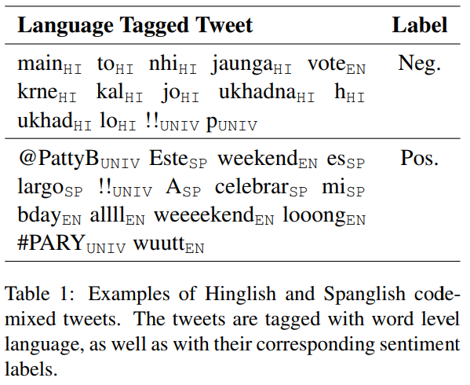

# Samuel Narvaez

## Proposal 1: Identifying and Annotating Named Languages in Tweets
### Data: 
Getting Twitter Data in Python Using Tweepy and API Access
### Abstract:

linguistic code-switching, also known as code-mixing, is common among multilingual speakers. The lack of annotated data combined with the high diversity of languages in which this phenomenon can occur makes it difficult to achieve generality in code-switching related NLP tasks. Even though code-switching is largely captured in social media platforms, it is still expensive to annotate a sufficient amount of data for many tasks and languages. Additionally, not all the languages have the same incidence and predominance, making annotations impractical for every combination of languages. Nevertheless, code-switching often occurs in language pairs that include English. I want to explore levaraging English pre-trained models like ELMo or BERT and tailoring them to perform well in code-switching settings. 

### Goals:
* Using Twitter Developer API to pull tweets that engage in translanguaging and code-switching with English language pairs, maybe with a primary focus on the English/Spanish, English/Portuguese language pairs, as I have the most personal experience code-switching in those languages. 
* Experiment with ELMo and BERT for Sequence Tagging, Labling the parts of the tweets that are associated with named languages. 

Something to the effect of (Although hopefully more beautiful than):



* Build or find a sufficient labled set to train/test. 

### Citations:
* [Processing and Understanding Mixed Language Data](https://genius1237.github.io/emnlp19_tut/)
```bibtex
@inproceedings{choudhury-etal-2019-processing,
    title = "Processing and Understanding Mixed Language Data",
    author = "Choudhury, Monojit  and
    Srinivasan, Anirudh  and
    Dandapat, Sandipan",
    booktitle = "Proceedings of the 2019 Conference on Empirical Methods in Natural Language
        Processing and the 9th International Joint Conference on Natural Language Processing
        (EMNLP-IJCNLP): Tutorial Abstracts",
    month = nov,
    year = "2019",
    address = "Hong Kong, China",
    publisher = "Association for Computational Linguistics"
}
```
* [EN-ES-CS: An English-Spanish Code-Switching Twitter Corpus for Multilingual Sentiment Analysis](https://www.aclweb.org/anthology/L16-1655.pdf)
* [Functions of Code-Switching in Tweets: An Annotation Scheme and Some Initial Experiments](https://www.aclweb.org/anthology/L16-1260.pdf)
* [Code-Switching Papers](https://github.com/gentaiscool/code-switching-papers)
## Proposal 2: Squeezr, a Dashbord for community organizing
### Data: 
Stock Market API, something like [AlphaVantage](https://www.alphavantage.co)
### Abstract:
In 2019, the strip-mall fixture GameStop lost almost $500 million. In 2020, a pandemic forcibly shut down many of its stores and gutted its revenue. As of January 10, 2021 nine brokerages had set the one-year target stock price for GameStop at about $10. But that’s not where it would stay. It climbed in price because a subreddit, r/WallStreetBets, engineered a short squeeze. One hedge fund, Melvin Capital Management, has lost at least $2 billion
### Goals:
* Find squeezes happening now
* Find stocks with the largest short positions
* Present the stocks with the most short vulnerability in a dashboard that is clear and accessible to facilitate community organizing on the scale of r/WallStreetBets with GME to engineer more short squeezes and take down more hedge funds.
## Proposal 3:
### Data:
### Abstract:
### Goals:
